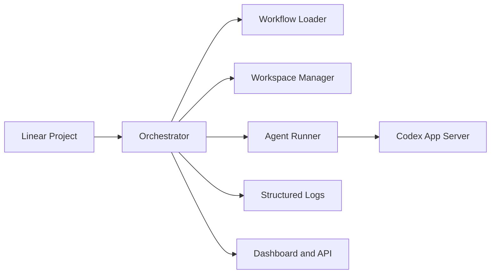

# Symphony

**Symphony turns project work into isolated, autonomous implementation runs, so teams can manage work instead of supervising coding agents.**

Symphony is a TypeScript orchestration service for agent-driven software delivery. It continuously reads work from your tracker, creates a dedicated workspace for each issue, runs a coding agent inside that boundary, and gives operators a clean surface for runtime visibility, retries, and control.

It is built for teams that already believe in harness engineering and want to move one layer higher: from “how do we prompt an agent well?” to “how do we reliably run work through an agent system?”

> [!WARNING]
> Symphony is designed for trusted environments. Treat it as powerful infrastructure, not a consumer-grade autopilot.

## Why Symphony

Coding agents are not the hard part anymore. Operating them is.

Without orchestration, teams usually end up with brittle scripts, shared working directories, hidden prompt logic, and no reliable way to see what multiple agents are doing. Symphony replaces that with a durable service model:

- one issue, one workspace, one bounded execution context
- repository-owned workflow policy through `WORKFLOW.md`
- continuous polling, dispatching, retrying, and reconciliation
- structured logs and an observability surface for operators
- predictable handoff points like review, merge, or human intervention

## Core Capabilities

### Tracker-driven execution

Symphony watches your issue tracker for eligible work and turns tickets into autonomous runs. In the current service model, Linear is the primary tracker integration.

### Isolated workspaces

Every issue gets a deterministic workspace. Agent commands execute inside that issue-specific directory, which keeps runs separated, reproducible, and safer to operate.

### Repository-owned workflow contract

Runtime behavior is defined by a `WORKFLOW.md` file in the repository. YAML front matter configures the service, while the Markdown body becomes the agent prompt template.

### Long-running orchestration

Symphony is a service, not a one-off script. It handles polling, claiming, retries, continuation turns, state reconciliation, and cleanup when issues become ineligible.

### Observability by default

Operators get structured logs, runtime snapshots, and an HTTP dashboard/API surface for answering practical questions such as:

- What is running right now?
- Which issue is retrying, and why?
- What workspace is attached to a ticket?
- What did the last agent session report?

### Dynamic tool support

During live agent sessions, Symphony can expose a `linear_graphql` tool so workflow skills can make raw Linear GraphQL calls for advanced tracker operations.

## How It Works



Execution flow:

1. Symphony polls the tracker for candidate issues.
2. It filters for eligible work based on workflow policy and issue state.
3. It creates or reuses the workspace for the issue.
4. It renders the prompt from `WORKFLOW.md`.
5. It launches the coding agent in app-server mode inside the workspace.
6. It reconciles issue state, schedules retries when needed, and stops runs when the ticket becomes terminal or ineligible.
7. It exposes runtime state through logs and optional HTTP endpoints.

## Example Workflow Contract

```md
---
tracker:
  kind: linear
  project_slug: my-project
workspace:
  root: ~/code/symphony-workspaces
hooks:
  after_create: |
    git clone --depth 1 git@github.com:your-org/your-repo.git .
agent:
  max_concurrent_agents: 10
  max_turns: 20
codex:
  command: codex app-server
---

You are working on Linear issue {{ issue.identifier }}.

Title: {{ issue.title }}
Description: {{ issue.description }}

Follow the repository workflow, produce a clean implementation, and stop at the required handoff state.
```

This model keeps the automation contract versioned with the codebase, which is one of Symphony’s biggest advantages over control-plane-heavy agent setups.

## Running Symphony

### Requirements

- Node.js `>= 22`
- pnpm `>= 10`
- a tracker token such as `LINEAR_API_KEY`
- a repository with a valid `WORKFLOW.md`
- a coding agent runtime that supports app-server mode

### Install

```bash
pnpm install
```

### Development Commands

```bash
pnpm build
pnpm test
pnpm lint
pnpm format
```

### Typical Setup

1. Create a `WORKFLOW.md` for your repository.
2. Point Symphony at a workspace root where issue worktrees can live.
3. Provide tracker credentials and agent runtime configuration.
4. Start the service with your workflow file.
5. Open the observability dashboard or inspect the JSON API to monitor runs.

## What Teams Use It For

- autonomous implementation of backlog items from Linear
- isolated execution for parallel agent work across many tickets
- standardized review handoff for CI, PR feedback, and merge readiness
- operating agent workflows as infrastructure instead of as ad hoc local scripts

## Repository Layout

```text
src/
  agent/           prompt building and run lifecycle
  codex/           app-server protocol client and dynamic tools
  config/          workflow parsing, defaults, validation, reload
  domain/          shared runtime models
  logging/         structured logs and runtime snapshots
  observability/   HTTP dashboard and JSON API
  orchestrator/    dispatch, retry, and reconciliation
  tracker/         Linear integration and normalization
  workspace/       workspace safety, creation, and hooks
tests/             behavioral and integration-oriented tests
```

## Philosophy

Symphony is opinionated in the places that matter:

- work is tracked outside the agent and executed inside strict workspace boundaries
- policy belongs to the repository, not a hidden SaaS layer
- operators need observability, not mystery
- autonomous runs should end in explicit handoff states, not vague “done” claims

## Source Of Truth

- Product model and service behavior: [`SPEC.upstream.md`](/Users/wangruobing/Personal/symwork/symphony/SPEC.upstream.md)
- Upstream project framing: [`README.upstream.md`](/Users/wangruobing/Personal/symwork/symphony/README.upstream.md)
- Local implementation sequencing: [`IMPLEMENTATION_PLAN.md`](/Users/wangruobing/Personal/symwork/symphony/IMPLEMENTATION_PLAN.md)
- Repository contribution rules: [`AGENTS.md`](/Users/wangruobing/Personal/symwork/symphony/AGENTS.md)

## Contributing

Contributions should follow the repository rules in [`AGENTS.md`](/Users/wangruobing/Personal/symwork/symphony/AGENTS.md). Keep behavior aligned with [`SPEC.upstream.md`](/Users/wangruobing/Personal/symwork/symphony/SPEC.upstream.md), follow the execution order in [`IMPLEMENTATION_PLAN.md`](/Users/wangruobing/Personal/symwork/symphony/IMPLEMENTATION_PLAN.md), and keep implementation work paired with tests.
